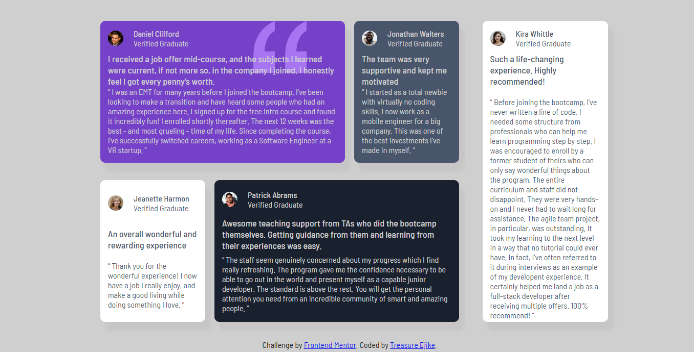

# Frontend Mentor - Testimonials grid section solution

This is a solution to the [Testimonials grid section challenge on Frontend Mentor](https://www.frontendmentor.io/challenges/testimonials-grid-section-Nnw6J7Un7). Frontend Mentor challenges help you improve your coding skills by building realistic projects. 

## Table of contents

- [Overview](#overview)
  - [The challenge](#the-challenge)
  - [Screenshot](#screenshot)
  - [Links](#links)
- [My process](#my-process)
  - [Built with](#built-with)
  - [What I learned](#what-i-learned)
  - [Useful resources](#useful-resources)
- [Author](#author)

## Overview

### The challenge

Users should be able to:

- View the optimal layout for the site depending on their device's screen size

### Screenshot



### Links

- Solution URL: [Add solution URL here](https://your-solution-url.com)
- Live Site URL: [Add live site URL here](https://your-live-site-url.com)

## My process

### Built with

- Semantic HTML5 markup
- CSS custom properties
- Flexbox
- CSS Grid
- Visual Studio Code
- Chrome Developer Tools


### What I learned

  In this project I learned how to use the CSS grid to display elements on a webpage: 

```html
<main>
      <section class="review-1">
      <aside class="review-2">
</main>        
```

```css
main {
    width: 90vw;
    height: 95vh;
    display: grid;
    grid-template: auto / auto auto;
    justify-content: center;
    align-items: center;
}
```

### Useful resources
-[layout.bradwoods.io](https://www.layout.bradwoods.io)
-[chatGPT](https://www.chatopenai.com)
-[W3schools](https://www.w3schools.com)

## Author

- Frontend Mentor - [@devTetra](https://www.frontendmentor.io/profile/devTetra)
- Twitter - [@tetra_codes](https://twitter.com/tetra_codes)